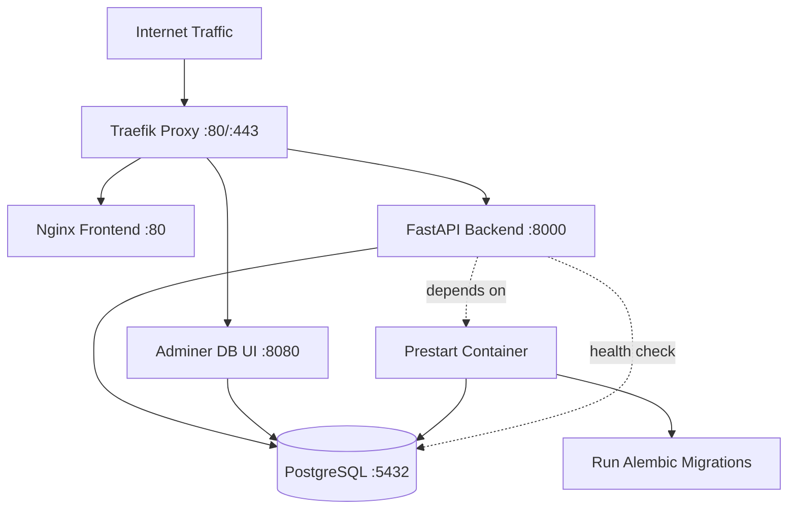

# 🏗️ Full-Stack FastAPI Template - Complete Architecture Guide

## 📋 Table of Contents

1. [🔍 Project Overview](#-project-overview)
2. [🐳 Docker Infrastructure Deep Dive](#-docker-infrastructure-deep-dive)
3. [⚡ Traefik Reverse Proxy](#-traefik-reverse-proxy)
4. [🐘 PostgreSQL Database](#-postgresql-database)
5. [🌐 Nginx & Frontend Serving](#-nginx--frontend-serving)
6. [💾 Docker Volumes & Persistent Storage](#-docker-volumes--persistent-storage)
7. [🚀 Backend Architecture](#-backend-architecture)
8. [🎨 Frontend Architecture](#-frontend-architecture)
9. [🔒 Authentication & Security](#-authentication--security)
10. [🛠️ Development Tools & Automation](#-development-tools--automation)
11. [📦 Deployment Scenarios](#-deployment-scenarios)
12. [🚨 Common Problems & Solutions](#-common-problems--solutions)

---

## 🔍 Project Overview

This is a **production-ready full-stack template** with complete Docker orchestration, automatic SSL certificates, and modern development tools.

### Technology Stack

**Backend:**
- **FastAPI** (Python 3.10+) - High-performance async web framework
- **SQLModel** - Type-safe ORM combining SQLAlchemy + Pydantic
- **PostgreSQL 17** - Primary database
- **uv** - Ultra-fast Python package manager (10-100x faster than pip)
- **Alembic** - Database migration tool
- **JWT** - Token-based authentication

**Frontend:**
- **React 18** - UI library with hooks
- **TypeScript** - Type-safe JavaScript
- **Chakra UI v3** - Modern component library
- **TanStack Router** - Type-safe file-based routing
- **TanStack Query** - Server state management
- **Vite** - Lightning-fast build tool

**Infrastructure:**
- **Docker & Docker Compose** - Container orchestration
- **Traefik v3** - Reverse proxy with automatic SSL
- **Let's Encrypt** - Free SSL certificates
- **Nginx** - Static file serving in production

---

## 🐳 Docker Infrastructure Deep Dive

### Container Architecture Overview

The project uses **multiple Docker Compose configurations** for different environments:

```
docker-compose.yml           # Production configuration
docker-compose.override.yml  # Development overrides (auto-loaded)
docker-compose.traefik.yml  # Traefik proxy setup (separate deployment)
```

### Service Dependency Graph



### Production Services Deep Dive

#### 1. PostgreSQL Database (`db`)

**Container Configuration:**
```yaml
db:
  image: postgres:17  # Latest stable PostgreSQL
  restart: always     # Auto-restart on failure
  healthcheck:
    test: ["CMD-SHELL", "pg_isready -U ${POSTGRES_USER} -d ${POSTGRES_DB}"]
    interval: 10s
    retries: 5
    start_period: 30s  # Grace period for startup
    timeout: 10s
  volumes:
    - app-db-data:/var/lib/postgresql/data/pgdata  # Named volume
  environment:
    - PGDATA=/var/lib/postgresql/data/pgdata  # Custom data directory
    - POSTGRES_PASSWORD=${POSTGRES_PASSWORD?Variable not set}
    - POSTGRES_USER=${POSTGRES_USER?Variable not set}
    - POSTGRES_DB=${POSTGRES_DB?Variable not set}
```

**Key Points:**
- **Health checks** ensure database is ready before dependent services start
- **Named volume** `app-db-data` persists data across container recreations
- **Custom PGDATA path** prevents Docker volume conflicts
- **Environment validation** with `?Variable not set` ensures required vars exist

#### 2. Prestart Service (One-time Initialization)

**Purpose:** Runs **ONCE** before backend starts to:
1. Wait for database to be healthy
2. Run Alembic migrations
3. Create initial superuser
4. Seed initial data

**Configuration:**
```yaml
prestart:
  image: '${DOCKER_IMAGE_BACKEND}:${TAG-latest}'
  depends_on:
    db:
      condition: service_healthy  # Wait for DB health check
      restart: true               # Retry if DB not ready
  command: bash scripts/prestart.sh
```

**Prestart Script (`backend/scripts/prestart.sh`):**
```bash
#!/usr/bin/env bash
set -e  # Exit on error

# Wait for database
python app/backend_pre_start.py  # Polls DB until ready

# Run migrations
alembic upgrade head

# Create initial data
python app/initial_data.py  # Creates superuser if not exists
```

#### 3. FastAPI Backend

**Production Configuration:**
```yaml
backend:
  image: '${DOCKER_IMAGE_BACKEND}:${TAG-latest}'
  restart: always
  depends_on:
    db:
      condition: service_healthy
    prestart:
      condition: service_completed_successfully  # Must complete!
  healthcheck:
    test: ["CMD", "curl", "-f", "http://localhost:8000/api/v1/utils/health-check/"]
    interval: 10s
    timeout: 5s
    retries: 5
  command: ["fastapi", "run", "--workers", "4", "app/main.py"]  # Multi-worker
```

**Production vs Development:**
- **Production:** 4 workers with uvicorn
- **Development:** Single process with --reload

#### 4. Frontend (Nginx + React)

**Multi-stage Docker Build:**
```dockerfile
# Stage 1: Build
FROM node:20 AS build-stage
WORKDIR /app
COPY package*.json /app/
RUN npm ci  # Clean install from lock file
ARG VITE_API_URL=${VITE_API_URL}  # Build-time API URL
RUN npm run build  # Creates optimized bundle

# Stage 2: Serve
FROM nginx:1
COPY --from=build-stage /app/dist/ /usr/share/nginx/html
COPY ./nginx.conf /etc/nginx/conf.d/default.conf
```

**Nginx Configuration:**
```nginx
server {
  listen 80;
  location / {
    root /usr/share/nginx/html;
    try_files $uri /index.html =404;  # SPA routing
  }
}
```

### Development Override Configuration

**Key Differences (`docker-compose.override.yml`):**

```yaml
backend:
  restart: "no"  # Don't auto-restart
  ports:
    - "8000:8000"  # Direct port access
  command: ["fastapi", "run", "--reload", "app/main.py"]
  develop:
    watch:  # File sync for hot reload
      - path: ./backend
        action: sync
        target: /app
        ignore: [".venv", "__pycache__"]
  volumes:
    - ./backend/htmlcov:/app/htmlcov  # Coverage reports

db:
  restart: "no"
  ports:
    - "5432:5432"  # Direct database access

proxy:  # Local Traefik
  command:
    - --api.insecure=true  # Dashboard without auth
    - --log.level=DEBUG
```

---

## ⚡ Traefik Reverse Proxy

### How Traefik Works

Traefik is a **modern reverse proxy** that:
1. **Automatically discovers** services via Docker labels
2. **Routes traffic** based on domain names
3. **Manages SSL certificates** automatically
4. **Load balances** between service instances

### Traefik Service Discovery

**Docker Label Configuration:**
```yaml
backend:
  labels:
    # Enable Traefik for this service
    - traefik.enable=true
    - traefik.docker.network=traefik-public

    # Service configuration
    - traefik.http.services.${STACK_NAME}-backend.loadbalancer.server.port=8000

    # HTTP router (redirects to HTTPS)
    - traefik.http.routers.${STACK_NAME}-backend-http.rule=Host(`api.${DOMAIN}`)
    - traefik.http.routers.${STACK_NAME}-backend-http.entrypoints=http
    - traefik.http.routers.${STACK_NAME}-backend-http.middlewares=https-redirect

    # HTTPS router
    - traefik.http.routers.${STACK_NAME}-backend-https.rule=Host(`api.${DOMAIN}`)
    - traefik.http.routers.${STACK_NAME}-backend-https.entrypoints=https
    - traefik.http.routers.${STACK_NAME}-backend-https.tls=true
    - traefik.http.routers.${STACK_NAME}-backend-https.tls.certresolver=le  # Let's Encrypt
```

### SSL Certificate Management

**Automatic Let's Encrypt Integration:**

1. **Initial Request:** Client requests `https://api.yourdomain.com`
2. **Certificate Check:** Traefik checks if certificate exists
3. **ACME Challenge:** If not, initiates Let's Encrypt TLS challenge
4. **Certificate Storage:** Stores in `/certificates/acme.json`
5. **Auto-Renewal:** Renews certificates before expiration

**Traefik Configuration:**
```yaml
command:
  - --certificatesresolvers.le.acme.email=${EMAIL}
  - --certificatesresolvers.le.acme.storage=/certificates/acme.json
  - --certificatesresolvers.le.acme.tlschallenge=true
volumes:
  - traefik-public-certificates:/certificates  # Persistent storage
```

### Network Architecture

**External Network (`traefik-public`):**
```bash
# Create once per server
docker network create traefik-public

# All services that need external access join this network
networks:
  traefik-public:
    external: true  # Must exist before docker-compose up
```

**Why External Network?**
- Single Traefik instance can serve **multiple projects**
- Services in different compose files can communicate
- Centralized SSL certificate management

---

## 🐘 PostgreSQL Database

### Database Lifecycle

#### 1. Initial Creation

**First `docker-compose up`:**
1. Docker creates `app-db-data` volume
2. PostgreSQL initializes database cluster
3. Creates database with provided credentials
4. Runs health checks until ready

#### 2. Migration Flow

**Alembic Migration Process:**
```
┌─────────────────┐
│ models.py       │ ← Define/modify SQLModel models
└────────┬────────┘
         ↓
┌─────────────────┐
│ alembic revision│ ← Generate migration
│ --autogenerate  │
└────────┬────────┘
         ↓
┌─────────────────┐
│ Review migration│ ← Check generated SQL
│ file            │
└────────┬────────┘
         ↓
┌─────────────────┐
│ alembic upgrade │ ← Apply to database
│ head            │
└─────────────────┘
```

**Migration Configuration (`backend/app/alembic/env.py`):**
```python
from app.models import SQLModel  # Import all models
from app.core.config import settings

target_metadata = SQLModel.metadata

def get_url():
    return str(settings.SQLALCHEMY_DATABASE_URI)
```

#### 3. Common Database Issues

**Issue: Migrations fail after model changes**
```bash
# Solution 1: Generate new migration
uv run alembic revision --autogenerate -m "Description"

# Solution 2: Stamp current state (development only!)
uv run alembic stamp head
```

**Issue: Database connection refused**
```bash
# Check if database is running
docker-compose ps db

# Check logs
docker-compose logs db

# Test connection
docker-compose exec backend psql -h db -U postgres -d app
```

**Issue: Volume permissions**
```bash
# Reset volume (WARNING: Deletes all data!)
docker-compose down
docker volume rm project_app-db-data
docker-compose up -d
```

### Database Backup & Restore

**Backup:**
```bash
# Backup to SQL file
docker-compose exec db pg_dump -U postgres app > backup_$(date +%Y%m%d).sql

# Backup volume directly
docker run --rm -v project_app-db-data:/data \
  -v $(pwd):/backup ubuntu tar czf /backup/db-backup.tar.gz -C /data .
```

**Restore:**
```bash
# Restore from SQL
docker-compose exec -T db psql -U postgres app < backup.sql

# Restore volume
docker run --rm -v project_app-db-data:/data \
  -v $(pwd):/backup ubuntu tar xzf /backup/db-backup.tar.gz -C /data
```

---

## 🌐 Nginx & Frontend Serving

### Build Process

**Development vs Production:**

| Aspect | Development | Production |
|--------|------------|------------|
| Server | Vite dev server (port 5173) | Nginx (port 80) |
| Build | On-the-fly compilation | Pre-built optimized bundle |
| Hot Reload | Yes (HMR) | No |
| Source Maps | Yes | Optional |
| Bundle Size | Large (unoptimized) | Small (minified) |
| API Proxy | Vite proxy config | Traefik routing |

### Production Build Pipeline

```bash
# 1. Install dependencies (cached layer)
COPY package*.json /app/
RUN npm ci --only=production

# 2. Copy source code
COPY ./ /app/

# 3. Inject build-time variables
ARG VITE_API_URL=https://api.yourdomain.com

# 4. Build production bundle
RUN npm run build
# → TypeScript compilation
# → Bundle optimization
# → Code splitting
# → Asset hashing
```

### Nginx Configuration Details

```nginx
server {
  listen 80;
  server_name _;

  # Gzip compression
  gzip on;
  gzip_types text/plain text/css application/json application/javascript;

  # Security headers
  add_header X-Frame-Options "SAMEORIGIN" always;
  add_header X-Content-Type-Options "nosniff" always;

  location / {
    root /usr/share/nginx/html;
    try_files $uri /index.html =404;  # SPA fallback

    # Cache static assets
    location ~* \.(js|css|png|jpg|jpeg|gif|ico|svg)$ {
      expires 1y;
      add_header Cache-Control "public, immutable";
    }
  }

  # Health check endpoint
  location /health {
    access_log off;
    return 200 "healthy\n";
  }
}
```

---

## 💾 Docker Volumes & Persistent Storage

### Volume Types Explained

#### 1. Named Volumes (Persistent Data)

**Database Volume:**
```yaml
volumes:
  app-db-data:  # Named volume declaration

services:
  db:
    volumes:
      - app-db-data:/var/lib/postgresql/data/pgdata
```

**Characteristics:**
- Managed by Docker
- Survives `docker-compose down`
- Located in `/var/lib/docker/volumes/`
- Backed up with Docker commands

#### 2. Bind Mounts (Development)

**Source Code Mounting:**
```yaml
services:
  backend:
    volumes:
      - ./backend:/app  # Bind mount for hot reload
```

**Characteristics:**
- Direct filesystem access
- Changes reflect immediately
- Used for development only
- Not portable across systems

#### 3. Anonymous Volumes (Temporary)

```yaml
volumes:
  - /app/node_modules  # Prevent overwriting
```

### Volume Lifecycle Management

**Creation Timeline:**
```
First docker-compose up
├── Creates named volumes
├── Creates networks
└── Starts containers

Container restart
├── Reuses existing volumes
└── Data persists

docker-compose down
├── Removes containers
├── Keeps volumes
└── Keeps networks

docker-compose down -v
├── Removes containers
├── DELETES volumes ⚠️
└── Removes networks
```

### Volume Backup Strategies

**Automated Backup Script:**
```bash
#!/bin/bash
# backup.sh

BACKUP_DIR="/backups"
DATE=$(date +%Y%m%d_%H%M%S)

# Database backup
docker-compose exec -T db pg_dump -U postgres app | \
  gzip > "$BACKUP_DIR/db_$DATE.sql.gz"

# Volume backup
docker run --rm \
  -v project_app-db-data:/data \
  -v "$BACKUP_DIR:/backup" \
  alpine tar czf "/backup/volume_$DATE.tar.gz" -C /data .

# Keep only last 7 days
find "$BACKUP_DIR" -name "*.gz" -mtime +7 -delete
```

---

## 🚀 Backend Architecture

### FastAPI Application Structure

```
backend/
├── app/
│   ├── api/
│   │   ├── deps.py           # Dependency injection
│   │   ├── main.py           # API router aggregation
│   │   └── routes/
│   │       ├── login.py      # Auth endpoints
│   │       ├── users.py      # User CRUD
│   │       └── utils.py      # Health checks
│   ├── core/
│   │   ├── config.py         # Settings management
│   │   ├── db.py            # Database setup
│   │   └── security.py      # Password hashing, JWT
│   ├── alembic/
│   │   └── versions/         # Migration files
│   ├── models.py            # SQLModel definitions
│   ├── crud.py              # Database operations
│   ├── utils.py             # Utilities
│   ├── main.py              # FastAPI app
│   └── initial_data.py      # Seed data
├── tests/
│   └── ...                  # Test files
└── scripts/
    └── prestart.sh          # Initialization script
```

### Dependency Injection Pattern

**Authentication Dependencies:**
```python
# app/api/deps.py

async def get_current_user(
    session: SessionDep,
    token: str = Depends(oauth2_scheme)
) -> User:
    credentials_exception = HTTPException(
        status_code=401,
        detail="Could not validate credentials",
        headers={"WWW-Authenticate": "Bearer"},
    )
    payload = jwt.decode(token, settings.SECRET_KEY, algorithms=[ALGORITHM])
    user = session.get(User, payload["sub"])
    if not user:
        raise credentials_exception
    return user

# Type alias for cleaner code
CurrentUser = Annotated[User, Depends(get_current_user)]
SessionDep = Annotated[Session, Depends(get_session)]
```

**Usage in Routes:**
```python
@router.get("/me", response_model=UserPublic)
def read_user_me(current_user: CurrentUser) -> Any:
    """Get current user."""
    return current_user

@router.get("/admin-only")
def admin_endpoint(
    current_user: CurrentUser = Depends(get_current_active_superuser)
) -> Any:
    """Admin only endpoint."""
    return {"message": "Admin access granted"}
```

### Database Models with SQLModel

**Model Definition:**
```python
from sqlmodel import Field, SQLModel, Relationship
import uuid
from datetime import datetime

class UserBase(SQLModel):
    username: str = Field(unique=True, index=True, min_length=3, max_length=50)
    is_active: bool = True
    is_superuser: bool = False
    full_name: str | None = Field(default=None, max_length=255)

class User(UserBase, table=True):  # table=True creates DB table
    id: uuid.UUID = Field(default_factory=uuid.uuid4, primary_key=True)
    hashed_password: str
    created_at: datetime = Field(default_factory=datetime.utcnow)
    updated_at: datetime = Field(default_factory=datetime.utcnow)

# API Schemas
class UserCreate(UserBase):
    password: str

class UserPublic(UserBase):
    id: uuid.UUID
```

### CRUD Operations Pattern

```python
# app/crud.py

def create_user(*, session: Session, user_create: UserCreate) -> User:
    db_obj = User.model_validate(
        user_create,
        update={"hashed_password": get_password_hash(user_create.password)}
    )
    session.add(db_obj)
    session.commit()
    session.refresh(db_obj)
    return db_obj

def get_user_by_username(*, session: Session, username: str) -> User | None:
    statement = select(User).where(User.username == username)
    return session.exec(statement).first()
```

### Configuration Management

**Settings with Pydantic:**
```python
# app/core/config.py

class Settings(BaseSettings):
    model_config = SettingsConfigDict(
        env_file="../.env",  # Load from project root
        env_ignore_empty=True,
        extra="ignore",
    )

    # API Configuration
    API_V1_STR: str = "/api/v1"
    SECRET_KEY: str = secrets.token_urlsafe(32)
    ACCESS_TOKEN_EXPIRE_MINUTES: int = 60 * 24 * 8  # 8 days

    # Database
    POSTGRES_SERVER: str
    POSTGRES_USER: str
    POSTGRES_PASSWORD: str
    POSTGRES_DB: str = "app"

    @computed_field
    @property
    def SQLALCHEMY_DATABASE_URI(self) -> PostgresDsn:
        return MultiHostUrl.build(
            scheme="postgresql+psycopg",
            username=self.POSTGRES_USER,
            password=self.POSTGRES_PASSWORD,
            host=self.POSTGRES_SERVER,
            path=self.POSTGRES_DB,
        )

    # Validation
    @model_validator(mode="after")
    def _enforce_non_default_secrets(self) -> Self:
        if self.ENVIRONMENT != "local":
            if self.SECRET_KEY == "changethis":
                raise ValueError("Change SECRET_KEY in production!")
        return self

settings = Settings()
```

---

## 🎨 Frontend Architecture

### Modern React Stack

```
frontend/src/
├── client/              # Generated API client
│   ├── sdk.gen.ts      # Service classes
│   ├── types.gen.ts    # TypeScript types
│   └── core/           # HTTP client
├── components/
│   ├── Common/         # Shared components
│   ├── Admin/          # Admin features
│   └── ui/            # Base UI components
├── hooks/              # Custom React hooks
│   ├── useAuth.ts     # Authentication
│   └── useCustomToast.ts
├── routes/            # File-based routing
│   ├── __root.tsx     # Root layout
│   ├── _layout.tsx    # Auth layout
│   ├── login.tsx      # Public route
│   └── _layout/       # Protected routes
│       ├── index.tsx  # Dashboard
│       └── admin.tsx  # Admin panel
└── main.tsx           # App entry point
```

### TanStack Router (Type-safe Routing)

**File-based Route Generation:**
```typescript
// routes/_layout.tsx - Protected layout
export const Route = createFileRoute('/_layout')({
  beforeLoad: async ({ context, location }) => {
    if (!context.auth.isAuthenticated) {
      throw redirect({
        to: '/login',
        search: {
          redirect: location.href,
        },
      })
    }
  },
  component: LayoutComponent,
})

// Routes are automatically type-safe
const navigate = useNavigate()
navigate({ to: '/users/$userId', params: { userId: '123' } })  // Type-checked!
```

### TanStack Query (Server State)

**Data Fetching Pattern:**
```typescript
// hooks/useUsers.ts
export const useUsers = () => {
  return useQuery({
    queryKey: ['users'],
    queryFn: () => UsersService.readUsers(),
    staleTime: 5 * 60 * 1000,  // Consider data fresh for 5 minutes
    cacheTime: 10 * 60 * 1000,  // Keep in cache for 10 minutes
  })
}

// Mutations with optimistic updates
export const useUpdateUser = () => {
  const queryClient = useQueryClient()

  return useMutation({
    mutationFn: ({ id, data }: { id: string; data: UserUpdate }) =>
      UsersService.updateUser({ userId: id, requestBody: data }),
    onMutate: async ({ id, data }) => {
      // Optimistic update
      await queryClient.cancelQueries(['users', id])
      const previousUser = queryClient.getQueryData(['users', id])
      queryClient.setQueryData(['users', id], { ...previousUser, ...data })
      return { previousUser }
    },
    onError: (err, variables, context) => {
      // Rollback on error
      if (context?.previousUser) {
        queryClient.setQueryData(['users', variables.id], context.previousUser)
      }
    },
    onSettled: () => {
      // Refetch to ensure consistency
      queryClient.invalidateQueries(['users'])
    },
  })
}
```

### Chakra UI v3 Components

**Component Architecture:**
```typescript
// Custom component with Chakra UI
import { Card, Button, Input, Text } from "@chakra-ui/react"
import { Field } from "@/components/ui/field"

export const UserForm = ({ user, onSubmit }) => {
  const { register, handleSubmit, formState: { errors } } = useForm()

  return (
    <Card.Root>
      <Card.Header>
        <Card.Title>Edit User</Card.Title>
      </Card.Header>
      <Card.Body>
        <form onSubmit={handleSubmit(onSubmit)}>
          <Field label="Username" invalid={!!errors.username}>
            <Input {...register("username", { required: true })} />
            {errors.username && <Text color="red.500">Username is required</Text>}
          </Field>
          <Button type="submit" colorPalette="brand">
            Save
          </Button>
        </form>
      </Card.Body>
    </Card.Root>
  )
}
```

### TypeScript Client Generation

**Automatic Generation Flow:**
```bash
# 1. Backend generates OpenAPI schema
uv run python -c "from app.main import app; import json; \
  print(json.dumps(app.openapi(), indent=2))" > ../frontend/openapi.json

# 2. Generate TypeScript client
npm run generate-client

# 3. Use type-safe client
import { UsersService, type UserPublic } from '@/client'

const users: UserPublic[] = await UsersService.readUsers()
```

---

## 🔒 Authentication & Security

### JWT Authentication Flow

```
┌──────────┐      ┌──────────┐      ┌──────────┐
│  Client  │      │   API    │      │    DB    │
└────┬─────┘      └────┬─────┘      └────┬─────┘
     │                  │                  │
     │ POST /login      │                  │
     │ {username,password} │                  │
     ├─────────────────>│                  │
     │                  │ Query user       │
     │                  ├─────────────────>│
     │                  │<─────────────────┤
     │                  │ Verify password  │
     │                  │ Generate JWT     │
     │<─────────────────┤                  │
     │ {access_token}   │                  │
     │                  │                  │
     │ GET /users/me    │                  │
     │ Bearer {token}   │                  │
     ├─────────────────>│                  │
     │                  │ Validate JWT     │
     │                  │ Get user from DB │
     │                  ├─────────────────>│
     │                  │<─────────────────┤
     │<─────────────────┤                  │
     │  {user_data}     │                  │
```

### Security Implementation

**Password Hashing:**
```python
from passlib.context import CryptContext

pwd_context = CryptContext(schemes=["bcrypt"], deprecated="auto")

def verify_password(plain_password: str, hashed_password: str) -> bool:
    return pwd_context.verify(plain_password, hashed_password)

def get_password_hash(password: str) -> str:
    return pwd_context.hash(password)  # Bcrypt with salt
```

**JWT Token Management:**
```python
def create_access_token(subject: str) -> str:
    expire = datetime.utcnow() + timedelta(
        minutes=settings.ACCESS_TOKEN_EXPIRE_MINUTES
    )
    to_encode = {"exp": expire, "sub": str(subject)}
    encoded_jwt = jwt.encode(
        to_encode,
        settings.SECRET_KEY,
        algorithm="HS256"
    )
    return encoded_jwt
```

### CORS Configuration

```python
# app/main.py
app.add_middleware(
    CORSMiddleware,
    allow_origins=settings.all_cors_origins,  # From .env
    allow_credentials=True,
    allow_methods=["*"],
    allow_headers=["*"],
)

# .env configuration
BACKEND_CORS_ORIGINS="http://localhost:5173,https://dashboard.yourdomain.com"
```

---

## 🛠️ Development Tools & Automation

### uv Package Manager

**Why uv instead of pip:**
- **10-100x faster** installation
- **Built-in virtual environment** management
- **Lockfile support** (uv.lock)
- **Unified tooling** (replaces pip, pip-tools, pipx, poetry, pipenv)

**Essential Commands:**
```bash
# NEVER use python or pip directly!
uv run python script.py           # Run Python script
uv run fastapi dev app/main.py    # Start dev server
uv run pytest                     # Run tests
uv run ruff check .               # Lint code
uv run mypy .                     # Type checking
uv add package                    # Add dependency
uv sync                          # Sync dependencies from lock
```

### Code Quality Tools

**Ruff (Fast Python Linter):**
```toml
# pyproject.toml
[tool.ruff.lint]
select = [
    "E",    # pycodestyle errors
    "W",    # pycodestyle warnings
    "F",    # pyflakes
    "I",    # isort
    "B",    # flake8-bugbear
    "C4",   # flake8-comprehensions
    "UP",   # pyupgrade
]
```

**MyPy (Type Checking):**
```toml
[tool.mypy]
strict = true
exclude = ["venv", ".venv", "alembic"]
```

### Testing Strategy

**Backend Testing:**
```python
# tests/conftest.py
@pytest.fixture(scope="session")
def db():
    engine = create_engine(str(settings.SQLALCHEMY_DATABASE_URI))
    SQLModel.metadata.create_all(engine)
    with Session(engine) as session:
        yield session
        session.rollback()

# tests/api/test_users.py
def test_create_user(client: TestClient, superuser_token_headers: dict):
    data = {"username": "testuser", "password": "testpass"}
    response = client.post(
        "/api/v1/users/",
        headers=superuser_token_headers,
        json=data,
    )
    assert response.status_code == 200
    content = response.json()
    assert content["username"] == data["username"]
```

### Claude Code Hooks (Development Automation)

**Automatic Features:**
1. **Linting** - Runs every 3rd file edit
2. **Schema regeneration** - When models.py changes
3. **Context loading** - First time entering frontend/backend

**Hook Architecture:**
```
.claude/hooks/
├── post_tool_use.py     # After file edits
├── session_start.py     # Session initialization
├── status_line.py       # Show current directory
└── common.py           # Shared utilities
```

---

## 📦 Deployment Scenarios

### Development Environment

```bash
# Start all services with hot reload
docker-compose up

# Services available at:
# Frontend: http://localhost:5173
# Backend: http://localhost:8000
# Database: localhost:5432
# Adminer: http://localhost:8080
```

### Production Deployment

#### 1. Server Setup

```bash
# Install Docker
curl -fsSL https://get.docker.com | sh

# Create traefik network
docker network create traefik-public

# Deploy Traefik
cd /root/traefik
docker-compose -f docker-compose.traefik.yml up -d
```

#### 2. Environment Configuration

```bash
# Production .env
export ENVIRONMENT=production
export DOMAIN=yourdomain.com
export SECRET_KEY=$(python -c "import secrets; print(secrets.token_urlsafe(32))")
export POSTGRES_PASSWORD=$(python -c "import secrets; print(secrets.token_urlsafe(32))")
export FIRST_SUPERUSER_PASSWORD=$(python -c "import secrets; print(secrets.token_urlsafe(32))")
```

#### 3. Deploy Application

```bash
# Build and deploy
docker-compose -f docker-compose.yml up -d

# URLs:
# Frontend: https://dashboard.yourdomain.com
# API: https://api.yourdomain.com
# Admin: https://adminer.yourdomain.com
```

### Staging Environment

```bash
# Use different stack name
export STACK_NAME=myapp-staging
export DOMAIN=staging.yourdomain.com

# Deploy to staging
docker-compose -f docker-compose.yml up -d
```

---

## 🚨 Common Problems & Solutions

### Docker Issues

**Problem: Port already in use**
```bash
# Find process using port
lsof -i :8000
# Kill process
kill -9 <PID>
# Or use different port
```

**Problem: Traefik network not found**
```bash
docker network create traefik-public
```

**Problem: SSL certificate not working**
```bash
# Check Traefik logs
docker-compose -f docker-compose.traefik.yml logs traefik

# Common causes:
# - DNS not propagated
# - Port 80/443 blocked
# - Wrong email for Let's Encrypt
# - Rate limited (wait 1 hour)
```

### Database Issues

**Problem: Migration failures**
```bash
# Generate new migration
uv run alembic revision --autogenerate -m "fix"

# Reset migrations (dev only!)
docker-compose down
docker volume rm project_app-db-data
docker-compose up -d
```

**Problem: Connection refused**
```bash
# Check database health
docker-compose ps db
docker-compose logs db

# Test connection
docker-compose exec backend psql -h db -U postgres -d app
```

### Backend Issues

**Problem: Import errors**
```bash
# Always use absolute imports
from app.models import User  # ✅
from .models import User     # ❌

# Set PYTHONPATH in Dockerfile
ENV PYTHONPATH=/app
```

**Problem: uv command not found**
```bash
# Never use pip or python directly!
uv run python script.py       # ✅
python script.py             # ❌
```

### Frontend Issues

**Problem: API connection failed**
```bash
# Check VITE_API_URL
echo $VITE_API_URL

# For production build
docker build --build-arg VITE_API_URL=https://api.yourdomain.com frontend/
```

**Problem: TypeScript client outdated**
```bash
# Regenerate client
npm run generate-client
```

### Performance Issues

**Problem: Slow Docker builds**
```bash
# Enable BuildKit
export DOCKER_BUILDKIT=1

# Use cache mounts
RUN --mount=type=cache,target=/root/.cache/uv \
    uv sync --frozen
```

**Problem: Database slow**
```sql
-- Add indexes
CREATE INDEX idx_user_username ON user(username);

-- Check query performance
EXPLAIN ANALYZE SELECT * FROM user WHERE username = 'testuser';
```

---

## 📚 Best Practices Summary

### Development Workflow
1. **Always use uv** for Python operations
2. **Run tests** before committing
3. **Check linters** pass (ruff, mypy)
4. **Update migrations** when changing models
5. **Regenerate client** after API changes

### Security
1. **Change default passwords** in production
2. **Use strong SECRET_KEY**
3. **Configure CORS** properly
4. **Enable HTTPS** via Traefik
5. **Regular backups** of database

### Docker
1. **Use multi-stage builds** for smaller images
2. **Named volumes** for persistent data
3. **Health checks** for reliability
4. **External networks** for Traefik
5. **Explicit dependencies** with depends_on

### Code Quality
1. **Type hints** everywhere
2. **Pydantic validation** for data
3. **Dependency injection** for testing
4. **Consistent naming** conventions
5. **Documentation** for complex logic

---

This comprehensive guide covers the entire architecture of the Full-Stack FastAPI template, from Docker infrastructure to deployment strategies. Use it as a reference for understanding, extending, and deploying the application.
